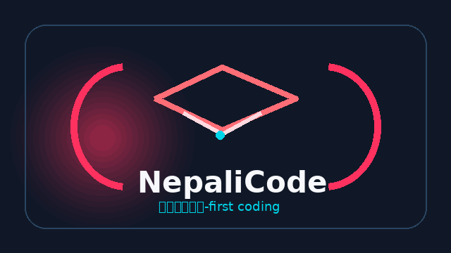

# NepaliCode

<p align="center">
  
</p>

<p align="center">
  <strong>A modern Nepali-first coding environment for Android.</strong><br />
  Write, explore, validate, and run NepaliCode programs from a focused mobile IDE.
</p>

<p align="center">
  <a href="https://github.com/NepaliSource/NepaliCode/releases"></a>
  <a href="https://github.com/NepaliSource/NepaliCode/actions"></a>
  <a href="https://github.com/NepaliSource/NepaliCode/blob/main/LICENSE"></a>
</p>

<p align="center">
  
</p>

> **NepaliCode** is an Android IDE and language playground designed to make programming with Nepali syntax approachable, visual, and practical.

## Why NepaliCode?

NepaliCode brings programming closer to Nepali-speaking learners and creators. The app combines a syntax-aware editor, a Nepali language runtime, project file management, references, terminal-style tools, package-oriented screens, and an extensible Compose interface in one mobile application.

The project is built for experimentation and education. It is intentionally readable, modular, and welcoming to contributors who want to improve the language, the Android experience, documentation, examples, or visual design.

## Highlights

| Area | What is included |
|---|---|
| **Language experience** | Nepali lexer, parser, AST model, interpreter, linter, standard library, values, tokens, and environment management. |
| **Mobile IDE** | Jetpack Compose interface with editor, file manager, reference view, terminal, package manager, theme selector, and web automation surfaces. |
| **Editing tools** | Syntax highlighting, tokenization, completion support, file creation, rename/delete flows, project scripts, and active-file handling. |
| **Visual system** | Multiple IDE palettes, adaptive Material styling, NepaliCode logo assets, dark-focused developer UI, and animated repository artwork. |
| **Networking and AI-ready foundation** | Retrofit, OkHttp, Moshi, Firebase AI integration, App Check support, and coroutine-based Android services. |
| **Persistence** | Room-backed project data and a structure designed for future project synchronization and richer workspace features. |

## Screens and identity

The application uses the following Android identity in the current build:

| Metadata | Value |
|---|---|
| Application ID | `com.nepalicode.dev` |
| App name | `NepaliCode` |
| Version | `1.0.0` |
| Version code | `1` |
| Minimum Android version | API 24 |
| Target Android version | API 36 |
| License | MIT |

## Technology stack

NepaliCode is an Android Studio project using **Kotlin**, **Jetpack Compose**, **Material 3**, **AndroidX**, and **Gradle Kotlin DSL**. The language engine and user interface are organized as separate source areas so that language work can evolve independently from the Android presentation layer.

```text
app/src/main/java/com/nepalicode/dev/
├── nepalicode/data       Project and file data models
├── nepalicode/editor     Themes, tokenizer, highlighter, completion, editor tools
├── nepalicode/ui         Main screens and ViewModel-driven app flows
├── nepalicode/ui/components Reusable Compose dialogs and UI components
├── nepalilang/core       Lexer, parser, AST, interpreter, linter, runtime values
└── ui/theme               Compose colors, typography, and application theme
```

## Getting started

### Requirements

Install Android Studio with the Android SDK, Android SDK Platform 36, Android Build Tools 36, and a Java 21-compatible development environment. A Gemini API key may be required for AI-powered features; keep secrets in a local `.env` file and never commit credentials.

### Clone

```bash
git clone https://github.com/NepaliSource/NepaliCode.git
cd NepaliCode
```

### Configure local secrets

```bash
cp .env.example .env
# Edit .env and provide GEMINI_API_KEY when AI features are enabled.
```

### Build a debug APK

```bash
./gradlew assembleDebug
```

The debug APK is written to `app/build/outputs/apk/debug/app-debug.apk`.

### Build a release APK

```bash
./gradlew assembleRelease
```

For production distribution, use your own protected signing key and pass signing values through environment variables. Do not use a repository-stored keystore for a public release.

### Run tests

```bash
./gradlew test
```

## NepaliCode language direction

The language engine is intentionally decomposed into understandable stages:

1. **Lexing** converts source text into tokens.
2. **Parsing** builds an abstract syntax tree.
3. **Interpretation** evaluates the program inside a managed environment.
4. **Linting** identifies issues that can be explained to learners.
5. **Editor services** expose highlighting and completion information to the Android IDE.

Contributions that add syntax should include a small example, parser coverage, interpreter behavior, and documentation for users learning the feature.

## Roadmap

| Stage | Direction |
|---|---|
| **Now** | Stabilize the mobile editor, language runtime, project files, themes, and educational examples. |
| **Next** | Expand diagnostics, improve completion quality, add more standard-library capabilities, and strengthen test coverage. |
| **Later** | Add project export/import, richer package workflows, collaborative learning features, and a polished release channel. |

## Contributing

Contributions are welcome. Start by reading [CONTRIBUTING.md](CONTRIBUTING.md), review the [Code of Conduct](CODE_OF_CONDUCT.md), and open an issue before large architectural changes. Small, focused pull requests are easier to review and help preserve a reliable learning experience.

Useful contribution areas include Nepali language design, compiler/runtime correctness, Compose UI, accessibility, Android performance, test coverage, examples, documentation, translations, and developer tooling.

## Developer credits

NepaliCode is maintained by **Diwas Khatri** and the NepaliSource community.

- GitHub: [@diwaskhatri](https://github.com/diwaskhatri07)
- Organization: [NepaliSource](https://github.com/NepaliSource)
- Repository: [NepaliSource/NepaliCode](https://github.com/NepaliSource/NepaliCode)
- Project focus: Nepali programming education, language tooling, and accessible mobile development

If NepaliCode helps your learning or teaching, consider starring the repository, opening an issue with a concrete idea, or sharing a small example program.

## Support the project

Development time, testing, documentation, and language design all benefit from community support. If you would like to help sustain NepaliCode, use the funding links in [`.github/FUNDING.yml`](.github/FUNDING.yml) or visit the developer profile at [github.com/diwaskhatri](https://github.com/diwaskhatri).

## Releases

The repository publishes versioned Android artifacts through [GitHub Releases](https://github.com/NepaliSource/NepaliCode/releases). The release page contains the installable release APK, the debug APK for development, and checksums for verification.

## License

NepaliCode is released under the [MIT License](LICENSE). Third-party libraries remain subject to their respective licenses.

<p align="center">
  
</p>

<p align="center"><sub>Built with Kotlin, Compose, curiosity, and a commitment to Nepali-first developer tools.</sub></p>
